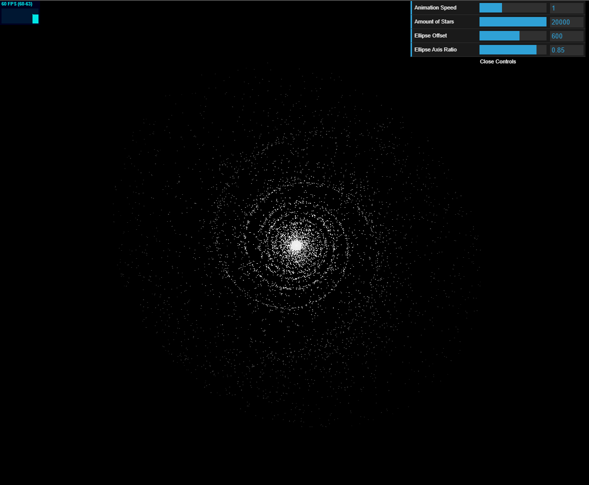

# density-wave

Application of the density wave theory based on [Ingo Berg's article](https://beltoforion.de/en/spiral_galaxy_renderer/), implemented in JavaScript.

# used libraries

- [three.js r128](https://github.com/mrdoob/three.js)
- [dat.gui v0.7.7](https://github.com/dataarts/dat.gui)
